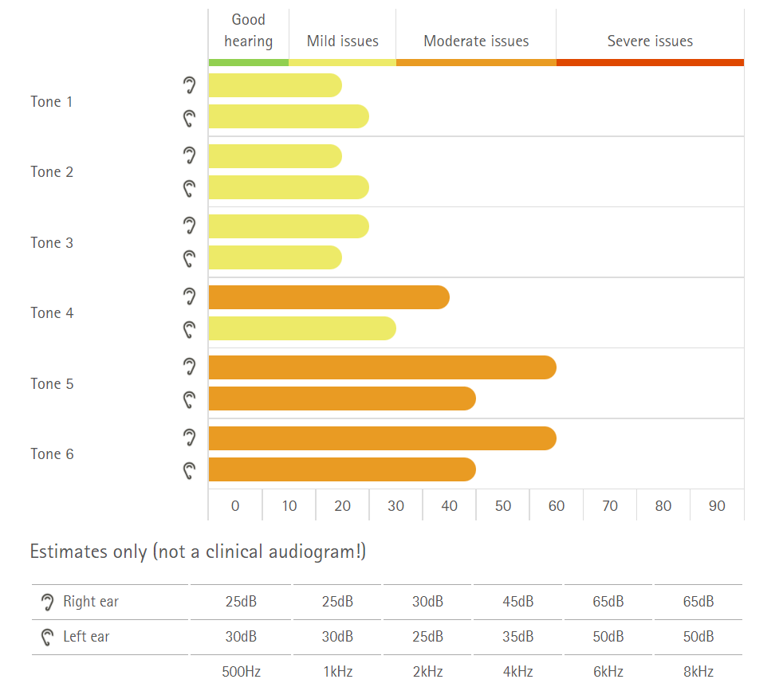

# Zadanie 1
## Test 1

Czasami wydawało mi się, że jak zmniejszam to nagle dźwięk się urywa i jak wracam o stopień wyżej to dalej nie słyszę i musiałem o 2 lub więcej podgłośnić aby słyszeć dźwięk. Wyniki wydają mi się w miare dobre. 

## Test 2

Test wykazał że mam problemy ze słuchem (tak samo jak poprzedni). Dzięki temu że test uwzględniał błędną pisownie moim zdaniem jest dość rzetelny. 
Raport: **test2.pdf**

## Test 3

Test bada na większych częstotliwościach i jest bardzo dokładny. Wykres jaki mi wyszedł przy podstawowym teście jest bardzo zbliżony do cząstockych testów. Uważam że test spełnia swoją rolę.
Raporty: **test3-pdst.pdf, test3-nizsze.pdf, test3-wyzsze.pdf**

# Zadanie 2
## Test 1

Każdy kolejny test zwiększał słyszalność odtwarzanego utworu. Dźwięk był bardziej skupiony, nie rozpraszał się wraz z dodawaniem kolejnych warstw odbijających. Ściana zbudowana jest z materiału który nie pochłania, ale odbija fale akustyczne. 

## Test 2

## Test 3

# Zadanie 3

## Próbkowanie

Odsłuchiwany dżwięk oscylatora zawiera 4 częstotliwości: 2kHz, 6kHz, 8kHz i 16kHz, które do pewnego momentu zwiększały spektogram widma, aż do osiągnięcia połowy częstotliowści próbkowania (czyli 22,05 kHZ). Takie zjawisko nazywamy antyalisingiem. Dźwięk bardzo przypomina te znane z filmów z cywilizacją pozaziemską. 

Pierwsza ścieżka dźwiękowa z pianiniem wyraźnie zawiera szum. Na wykresie spektrum widać, że wszystkie częstotliwości powyżej 4kHz zostały usunięte. Prawdopodobnie użyto przy próbkowaniu filtru antialiasingowego.

Dróga próbka nie zawiera szumu jak poprzednia, ale również ma częstotliowści tylko do 4kHz. Można stwierdzić, że po zastosowaniu filtra antialiasingowego zastosowano również filtrację antilustrzaną, tłumiąc zniekształcenia sygnału.

## Kwantyzacja
**Plik: quantization_sinus_mono_loweringBitDepth.wav**

Przy pomocy wykresu amplitudy można zaobserować że kwantyzacja 3-bitowa zaczyna się ok 21 sekundy. Błąd kwantyzacji mozna zaobserwować wraz ze spadkiem częstotliwości oraz jako dźwięk szumu oświetlenia (świetlówek).

**Plik: Piano_16b_to_2b_to_16b_quantizer1.wav**
Kwantyzacja 2-bitowa pojawia się w 16 sekundzie nagrania. Został użyty kwantyzator mid-tred, ponieważ wykres amplitudy zawiera wartości 0.

**Plik: Piano_16b_to_2b_to_16b_quantizer2.wav**
Kwantyzacja 2-bitowa pojawai się w 14 sekundzie, ponieważ można zaobserwować ciągłość dżwięku na wykresie amplitudy. W tym przypadku nie osiągamy wartości 0, tylko docieramy do niej, więc został użyty kwantyzator mid-rise.

**Plik: quantization_music_1_8bit_fade_error_compensated.wav**
Od początku słychać utwór z narastającym szumem, który w ok 46 prawie całkowicie przysłania muzykę.

**Plik: quantization_music_2_8bit_fade_error_compensated.wav**

## Dithering i kształtowanie szumu rekwantyzacji

